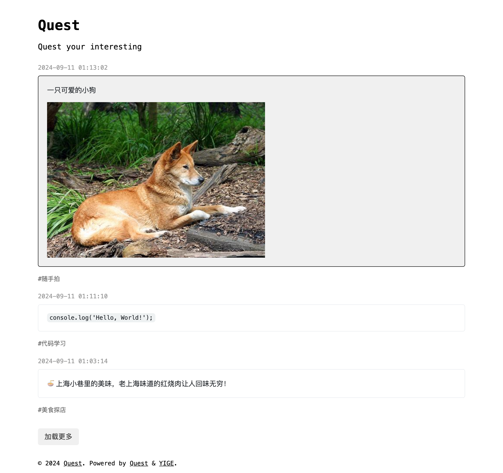

# Quest

一款轻量的 Memo 记录程序，基于 Bun + Hono + MongoDB 构建

> 适用于个人笔记、碎片知识记录或通过 Webhook 同步社交媒体内容聚合展示

## 特点

* 极度精简，仅支持 `Markdown` 笔记和标签功能
* 仅支持 API 进行笔记发布、查询、删除等操作，无前端管理后台
* 服务端渲染，SEO 友好

## 截图



## Live Demo

[Demo](https://www.tg.quest)

## 安装依赖

```sh
bun install
```

## 复制并修改配置文件

1. 复制 `.env.example` 为 `.env`
2. 提前在 MongoDB 中创建好对应的数据库
3. 修改 `.env` 中的环境变量（ MongoDB 链接地址、端口、用户名、密码、JWT 密钥、网站名称、描述、关键词等 ）

## 运行（开发环境）

```sh
# dev
bun run dev

# start
bun run start

# nohup 守护运行
nohup bun run start > output.log 2>&1 &
```

> 访问地址：http://localhost:8848

## API

星号标注接口需要鉴权，采用`JWT`形式鉴权，即需要在请求`header`中添加`Authorization`的值为`Bearer ${token}`。

1. 获取 Token

> [POST] /api/users/token

| 参数名   | 类型   | 必填 | 描述       |
|----------|--------|------|------------|
| name | string | 是   | 用户名     |
| password | string | 是   | 密码       |


2. 获取 Memo 列表

> [POST] /api/memo/list

| 参数名   | 类型   | 必填 | 描述       |
|----------|--------|------|------------|
| size | number | 是   | 每页数量     |
| prev | string | 否   | 上一个 memo 的 id，用于分页加载       |
| tags | array | 是   | 标签       |

3. 创建 Memo

> *[POST] /api/memo/create

| 参数名   | 类型   | 必填 | 描述       |
|----------|--------|------|------------|
| content | string | 是   | 内容     |
| tags | array | 是   | 标签       |

4. 修改 Memo

> *[POST] /api/memo/update

| 参数名   | 类型   | 必填 | 描述       |
|----------|--------|------|------------|
| id | string | 是   | 要修改的 memo 的 id     |
| content | string | 是   | 内容     |
| tags | array | 是   | 标签       |

5. 删除 Memo

> *[POST] /api/memo/delete

| 参数名   | 类型   | 必填 | 描述       |
|----------|--------|------|------------|
| id | string | 是   | 要删除的 memo 的 id     |

## 待办事项

- [ ] 支持 Android / IOS 客户端发布管理内容
- [ ] 内容缓存机制
